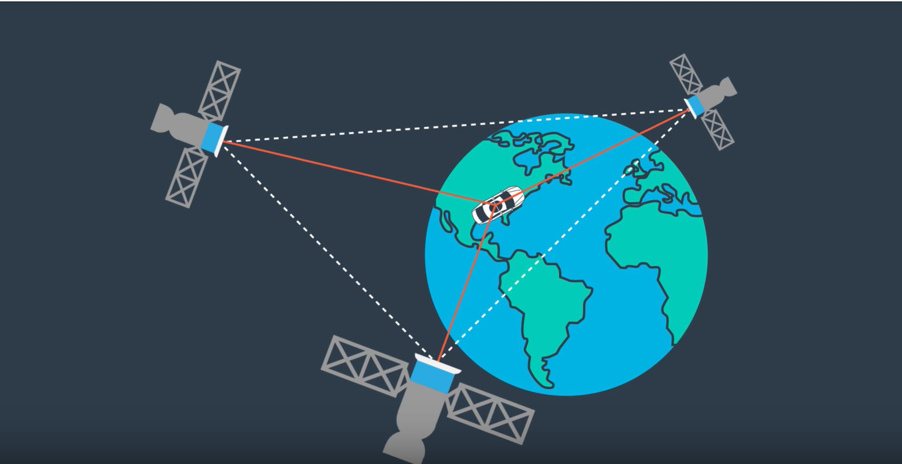
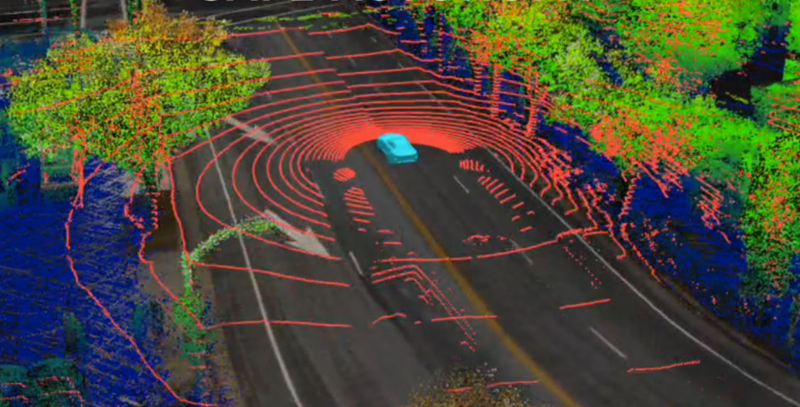
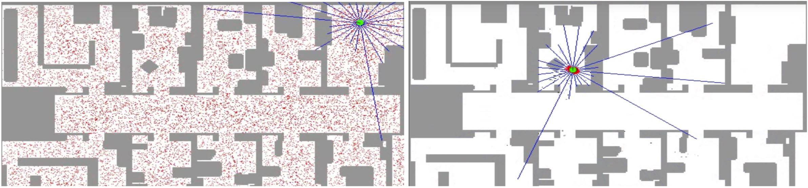
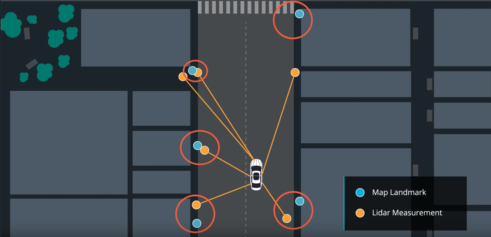

# Kidnapped-Vehicle
Particle Filter algorithm to localize a vehicle within a few centimeters, given a map, LiDAR measurements, vehicle controls and GPS.


 
 Traditional vehicles use GPS localization embedded in the navigation system. As long as a human is driving the car this localization is good enough. 

 The GPS localizes the car with an accuracy of about 2 meters giving the driver a general idea of where he/she is. The driver then visually percieves the world to get a sense of what's around. He/she can see how far the car is from the curb or stop sign and that is how he/she's able to maneuver the car.

 For a self driving car, a 2 meter localization accuracy is simply not enough. It could be in a whole different lane or on the sidewalk and it wouldn't know. For safety reasons and to even make self driving maneuvers possible, the localization precision needs to be within a few centimeters.


 

 To be able to localize itself, a self driving car needs to sense the world around. Since the most accurate sensor for distance measurement is the LiDAR, this is the way to go. 

 The self driving car also needs a map, but this is no usual map like in traditional navigation systems. The map that proves to be most useful is one made of landmark positions. The self driving car will rely on knowing where a building, stop sign, or light pole is in a given intersection, and then when measuring its distance to those landmarks is able to localize itself.

 Most landmark maps are built using LiDAR measurements, recording the landmark positions while the car is being driven around by a human driver. This means that the self driving car has _seen_ the streets before driving on them.

 # Particle Filter

 Based on [Bayes Theorem](https://en.wikipedia.org/wiki/Bayes%27_theorem) the [Particle Filter](https://en.wikipedia.org/wiki/Particle_filter) takes a probabilistic approach on possible positions of where the car could be and calculates the probability density.

 The particles are possible vechile positions, as the vehicle doesn't know where it is located. You spread the particles around on the map and calculate their likelihood. Each time the vehicle senses the world around, it measures its distance to known landmarks. 

 These distances are used to identify the particles that are likely to be positioned at those distances from the landmarks. Particles that have higher likelihoods are kept and can replace the ones that are unlikely, keeping the total number of particles constant. 

 With this approach you start with _N_ particles that are spread all over the map and as the vechicle moves around and senses the world, the _N_ particles tend to gravitate around the car forming a dense cloud.

 

 # Implementation

 This project is implemented in C++, the source code can be found in the *src* folder above. The started code for this project is provided by Udacity and can be found [here](https://github.com/udacity/CarND-Kidnapped-Vehicle-Project).

 The files in which the logic of the particle filter is implemented are:
 - particle_filter.cpp
 - particle_filter.h
 - helper_functions.h


 - **Initialization**

 This is where the number of particules _N_ is defined and particules are spread all over the map. 

 Regarding the number _N_, ideally this will be as big as possible. Imagine that you would like to have a particle in every square milimeter over the surface of the Earth. Computationally this is not possible so we need to pick something more reasonable. I picked 100 particles after tuning my particle filter. I started with a much larger number but realized that my algorithm was not passing the _performance test_ designed bu Udacity so I managed to lower this number witout compromising the final accuracy.

 As for spreading the particles over the entire map, this would literally mean the entire world if the vehicle had no idea where it was. Again this is not acceptable so I'll start with some additional information. Using the vehicle's GPS localization and its accuracy, I can initialize the particles in a more restricted area.

 Given the GPS localization as x, y and orientation theta, I use a Gaussian distribution based on the standard deviation `std` and a random generator to initialize the particles.

 ```
  // use a random number generator
  default_random_engine gen;
  // create a normal (Gaussian) distribution for x, y and theta
  normal_distribution<double> dist_x(x, std[0]);
  normal_distribution<double> dist_y(y, std[1]);
  normal_distribution<double> dist_theta(theta, std[2]);
 ```

 - **Prediction**

 The prediction and measurement steps are to be executed cyclically every time the vehicle moves and senses the world around. 

 The prediction step calculates the vehicle's theoretical position after it has moved for _delta t_ time with velocity _v_ and turning with _yaw rate_. 

 To simplify these calculations the bicycle model is used. This starts with the hypothesis that only the front wheels of the car are steering wheels and they are connected to the rear wheels by a rigid beam with fixed length. This makes the vehicle move like a bicycle and reduces the complexity of the kinematics equations.

 In the prediction step all _N_ particles need to be moved accordingly to the _v_ and _yaw rate_ measured from the real car in order to keep up with our moving vehicle.

 ```
 //calculate theta final given the yaw rate and the time elapsed
 theta_f = theta_0 + (yaw_rate * delta_t);
 //assure that theta is between 0 and 2*PI
 if (theta_f >= 2*M_PI){ theta_f = theta_f - 2*M_PI; }
 if (theta_f < 0.0 ) { theta_f = theta_f + 2*M_PI; }
 //calculate x and y final given the velocity, yaw rate and the time elapsed
 x_f = x_0 + ( (velocity/yaw_rate) * (sin(theta_f) - sin(theta_0)) );
 y_f = y_0 + ( (velocity/yaw_rate) * (cos(theta_0) - cos(theta_f)) );
 ```

 Since it's known for vehicles not to have perfect movement given a set of controls (_v_ and _yaw rate_) I added a Gaussian noise to the final position and orientation to make the model more plausible. 


 - **Measurement**

 In the measurement step, the vehicle senses the world around and calculates the likelihood of each particle to represent the real position of the car on the map.

 The measurements represent the LiDAR's sensing distances to the predefined landmarks. When the car senses the world it does so in a coordinate system where the car is at point (0,0). To further use these measurements or observations, they need to be transformed from the vehicle's coordinates to the map coodrinates.

 This means that we need to transform each observation to map coordinates using each particle's position and orientation to check if that particle's location is plausible.

 ```
 double obs_map_x  = particles[i].x + (cos(particles[i].theta) * observations[j].x) - (sin(particles[i].theta) * observations[j].y);
 double obs_map_y  = particles[i].y + (sin(particles[i].theta) * observations[j].x) + (cos(particles[i].theta) * observations[j].y);
 ```

 Now that we know how the world is seen from each of our _N_ particles we need to check if it matches the landmarks. One challenge is to match each observation to one landmark. The easiest way is to find the nearest neighbor. This means that each observation is paired with the closest landmark. This assumption works as long as the landmark map is not very dense.

 

 The last step is to calculate the likelihood of that observation to match the landmark. Obviously the further the observation is from the landmark, the less likely it is for the vehicle to be in the position from where the observation was made.

 Given the standard deviation for LiDAR measurements, I use a multivariate Gaussian distribution to calculate the weight of the particle given this observation.

 ```
 double gauss_norm;
  gauss_norm = 1 / (2 * M_PI * sig_x * sig_y);

  // calculate exponent
  double exponent;
  exponent = (pow(x_obs - mu_x, 2) / (2 * pow(sig_x, 2)))
               + (pow(y_obs - mu_y, 2) / (2 * pow(sig_y, 2)));
    
  // calculate weight using normalization terms and exponent
  double weight;
  weight = gauss_norm * exp(-exponent);
  ```

  Since each measurement could imply multiple observations, meaning that more than one landmark is observable from one location, the final weight of the particle is the product of all observations' weights.


 - **Resampling**

 At this point all particles' weights have been updated given the measurement. Some particles have higher weights, which means that the vehicle is more likely to be in one of those locations. Other particles have lower weights, meaning that they are further from the real position of the car on the map.

 In the resample step we want to pick the particles with higher weights and drop the particles with lower weights, while keeping the total number of particles constant _N_. This means that a particle with a high weight might be picked more than once.

 To do so, I randomly pick from the particles set, _N_ times each particle having the probability of being picked equal to its weight.

 ```
 // use a random numer generator
 default_random_engine gen;
 /use a discrete distribution to return integers in range [0, weights.size())
 //with probability proportional to weights[i]
 discrete_distribution<int> d(weights.begin(), weights.end());
  
 //draw num_particles particle from particles
 for (int i = 0; i < num_particles; ++i){
   //generate particle using discrete distribution
   resampled_particles.push_back(particles[d(gen)]);
 }
 particles = resampled_particles;
 ```


 - **Simulation** 


 To download the simulator go [here](https://github.com/udacity/self-driving-car-sim/releases).

 